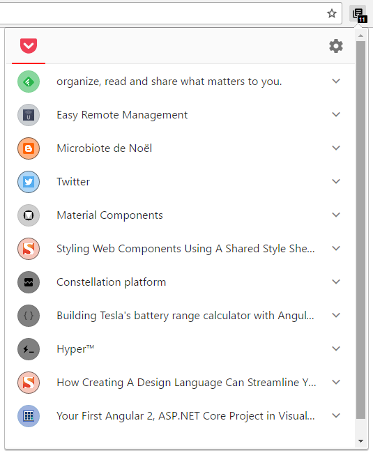
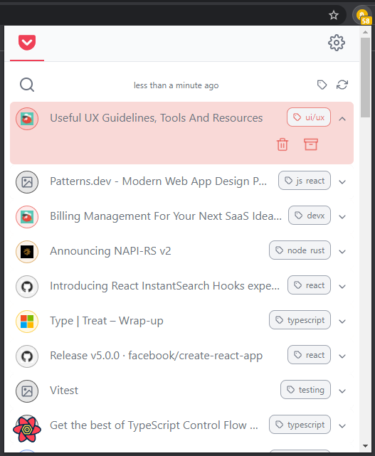
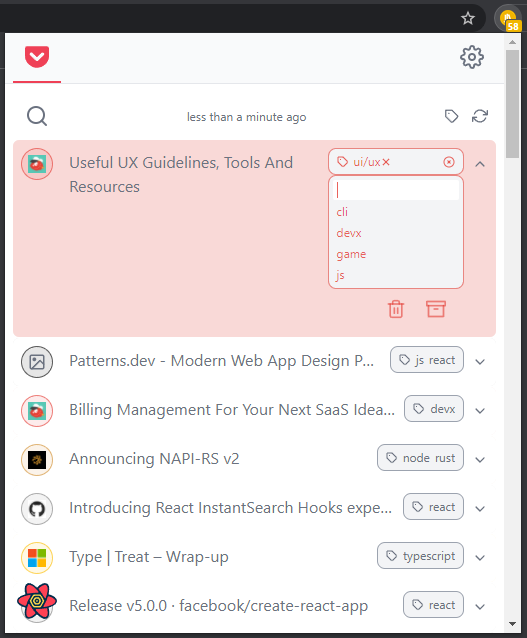
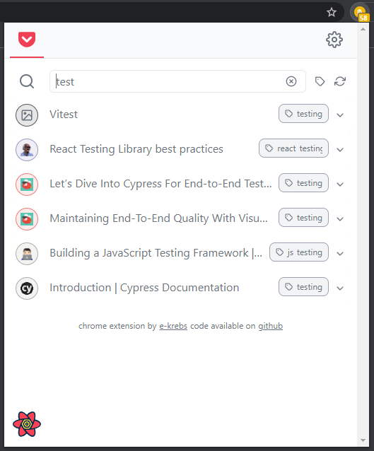
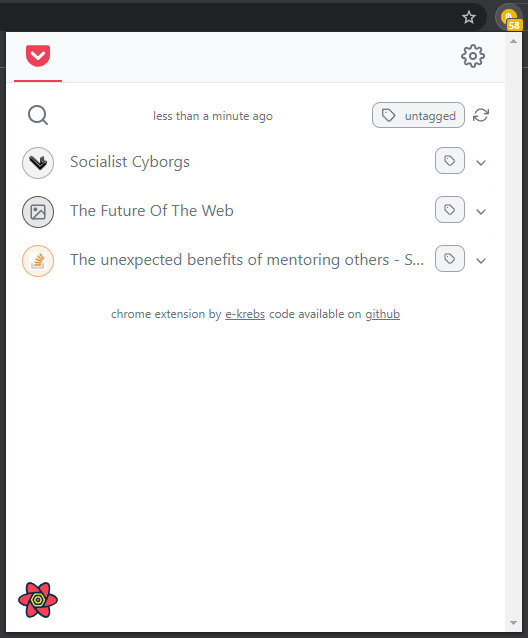

# Pile

> pile is a beautifully crafted chrome extension that show your [pocket](https://getpocket.com) list

| default view | item opened | adding tag |
|-|-|-|
|  |  |  |

| search filter | tag filter |
|-|-|
|  |  |

the icons color are dynamicaly computed thx to the [`extract-colors`][1] library

# Install
## From the chrome web store

[install from the chrome web store](https://chrome.google.com/webstore/detail/injagampgkalbbmhpemnfknoeghfenif)

## Your own version
First create a copy of `src/env.sample.json` into a new `src/env.json` file.

In order to have your own version, you must "create a new app" in the [pocket developer API](https://getpocket.com/developer/apps/).

Then, add the consumer key provided by pocket in the newly created `src/env.json` file by replacing the `XXXXX-XXXXXXXXXXX` chain.

Then, you either:
- (dev) run `yarn dev`
  - then import the `/dist` folder into `chrome://extensions` in your browser
- (prod) run `yarn build`
  - then import the `/dist/webext-prod` folder into `chrome://extensions` in your browser
  - by then running `yarn zip`, you can also generates a `pile.zip` file (in that folder) that you can upload to the chrome web store

# How to add a new Service to Pile
[see the dedicated readme](./src/services/README.md)
# Libraries
This project is built using:
- [typescript](https://www.typescriptlang.org/)
- [react](https://reactjs.org/)
- [tailwindcss](https://tailwindcss.com/)
- [extract-colors](https://github.com/Namide/extract-colors)
- [mui](https://mui.com/)
- [feather icons](https://feathericons.com/)
- [parcel.js](https://parceljs.org/)
- and plenty other tools and libraries that you can find in the **package.json**

[1]: https://github.com/Namide/extract-colors
