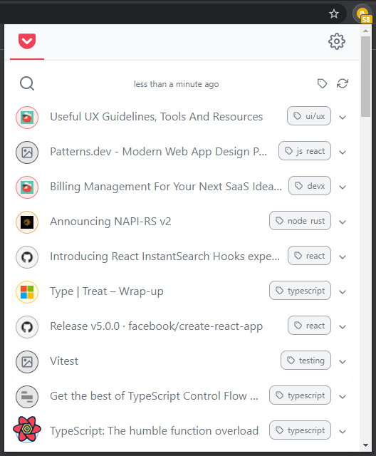

# Pile

> pile is a beautifully crafted chrome extension that show your [pocket](https://getpocket.com) list

| default view             | item opened                      | adding tag                     |
| ------------------------ | -------------------------------- | ------------------------------ |
|  |  |  |

| search filter                           | tag filter                           |
| --------------------------------------- | ------------------------------------ |
|  |  |

the icons color are dynamicaly computed thx to the [`extract-colors`][1] library

# Install

## From the chrome web store

[install from the chrome web store](https://chrome.google.com/webstore/detail/injagampgkalbbmhpemnfknoeghfenif)

## Your own version

> prerequisite: [bun](https://bun.sh/)

First create a copy of `src/env.sample.json` into a new `src/env.json` file.

In order to have your own version, you must "create a new app" in the [pocket developer API](https://getpocket.com/developer/apps/).

Then, add the consumer key provided by pocket in the newly created `src/env.json` file by replacing the `XXXXX-XXXXXXXXXXX` chain.

Run `bun install` once

Then, you either:

- (dev) run `bun run dev`
  - then import the `/dist` folder into `chrome://extensions` in your browser
- (prod) run `bun run build`
  - then import the `/dist/webext-prod` folder into `chrome://extensions` in your browser
  - by then running `bun run zip`, you can also generates a `pile.zip` file that you can upload to the chrome web store

# How to add a new Service to Pile

[see the dedicated readme](./src/services/README.md)

# Libraries

This project is built using:

- [typescript](https://www.typescriptlang.org/)
- [react](https://reactjs.org/)
- [tailwindcss](https://tailwindcss.com/)
- [extract-colors](https://github.com/Namide/extract-colors)
- [feather icons](https://feathericons.com/)
- [bun](https://bun.sh/)
- and plenty other tools and libraries that you can find in the **package.json**

[1]: https://github.com/Namide/extract-colors
